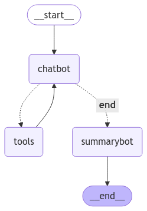

# Thoughtful AI Chatbot

A CLI-based chatbot built using LangGraph, designed to interact with users and provide intelligent responses.

## Features

- Interactive chat interface in the terminal.
- Uses the LangGraph framework for natural language processing.
- Continuously processes user inputs until a quit command is issued.

## Requirements

- Python 3.12
- Required Python libraries (see `requirements.txt` for details).

## Installation

1. Clone the repository:
    ```bash
    git clone https://github.com/wonhs91/thoughtfulai_chatbot.git
    cd thoughtfulai_chatbot
    ```
2. Create a virtual environment (optional but recommended):
    ```bash
    python -m venv .venv
    source venv/bin/activate   # On Windows: .venv\Scripts\activate
    ```
3. Install dependencies:
    ```bash
    pip install -r requirements.txt
    ```
4. Set up the .env file:
    - Create a .env file in the root directory of the project:
    ```bash
    touch .env # Or just create a new file
    ```
    - Add the following line to the .env file:
    ```env
    GROQ_API_KEY=your_api_key_here
    ```
    Replace your_api_key_here with your actual API key. You can retrieve the key from the [GROQ Console](https://console.groq.com/keys).

## Usage
1. Run the chatbot program:
    ```bash
    python chatbot.py
2. Start chatting with the bot! Type `q` to quit.

## Example Interaction
```
Chat with your LangGraph agent. Type 'q' to quit.

You: Hello!
Agent: Hi there! How can I assist you today?

You: What's the weather like?
Agent: I'm not sure, but I can help you find that out.

You: q
Exiting chat. Goodbye!
```

## Flow

1. Takes in the user input
2. Chatbot checks if the user query is about thoguhtfulAI and/or thoughtfulAI products
   - If so, it checks for the tool to retrieve thoughtful AI information
   - Generate response to the user query
3. If the message context is too long (6 messages), it summarizes the earlier messages.
4. Respond back to the user

## Improvements
- If the predefined data is bigger, I would use embed the data then store them into a vectorstore, then let the tool retrieve data from that vectorstore.
